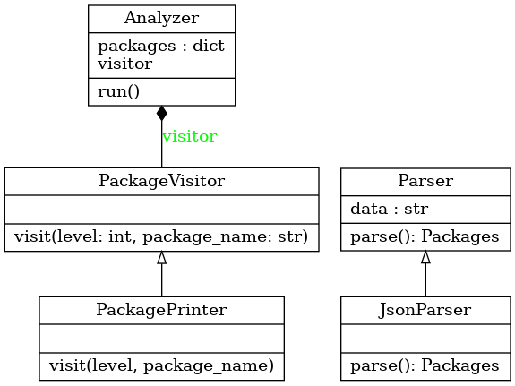

# DepGraph, an example dependency graph analyzer

Given a description of items and their mutual dependency, DepGraph prints, for each item, the recursive list of its dependencies.

## Installation

As simple as: `pip install dep_graph`

Installing the package will add "dep_graph" in your executable search path.

## Usage

``` shell
 ~/projects/dep_graph $ dep_graph -h
usage: dep_graph [-h] [input]

Simple Dependency Graph analyzer.

positional arguments:
  input       Input file containing package structure in JSON description. Use '-' for stdin (default).

optional arguments:
  -h, --help  show this help message and exit
```

For instance, given the following test file:
``` shell
 ~/projects/dep_graph $ cat /tmp/deps.json
{
"pkg1": ["pkg2", "pkg3"],
"pkg2": ["pkg3"],
"pkg3": []
}
```

Then there are 2 main ways of using the script:

``` shell
 ~/projects/dep_graph $ cat /tmp/deps.json | dep_graph
- pkg1
  - pkg2
    - pkg3
  - pkg3
- pkg2
  - pkg3
- pkg3
 ~/projects/dep_graph $ dep_graph /tmp/deps.json
- pkg1
  - pkg2
    - pkg3
  - pkg3
- pkg2
  - pkg3
- pkg3
```

## Design Notes

dep_graph defines 2 main interface classes:

- Parser: to convert packages structure from input format to Python object
  - The only available implementation is JsonParser
- PackageVisitor: to handle what to do when the package structure is traversed
  - The only available implementation, and the default, prints to stdout

Then, the work is done in the `Analyzer` class, which is currently implemented
using a simple recursion. For each package, the PackageVisitor is called to
handle what to do.

Class diagram:



## Limitations

DepGraph currently can't handle versions specifier.

## Further work

The following could be improved in the current implementation:

  * Use Dynamic Programming to store already solved dependencies: this could improve speed when handling large amounts of items
  * Use an external Graph Analysis library, for instance [networkx](https://networkx.org/): this would improve reuse and immediately provide additional functionality (plot dependency graph...)
  

## Development constraints
- Coding style: black
- Test Framework: pytest
